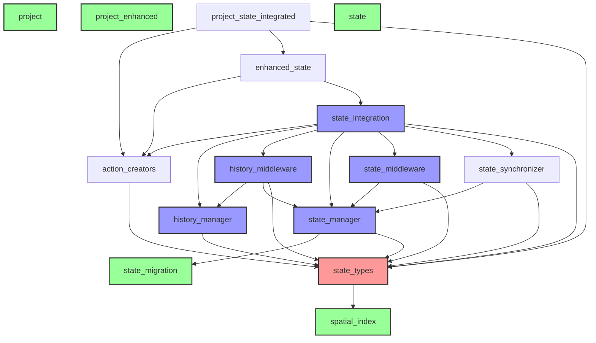

# Canvas Editor Dependency Analysis Report

## Executive Summary

- Total Python files analyzed: 66
- Manager modules analyzed: 16
- Circular dependencies found: 0

## Key Findings

### Module Categories

**Core Modules** (imported by 3+ other modules):
- action_creators
- state_manager
- state_types

**Hub Modules** (high connectivity):
- action_creators
- enhanced_state
- history_manager
- history_middleware
- project_state_integrated
- state_integration
- state_manager
- state_middleware
- state_synchronizer
- state_types

**Isolated Modules** (no manager dependencies):
- __init__
- project
- project_enhanced
- state

### Dependency Chains

**State Management Core:**
- state_types -> spatial_index
- state_manager -> state_types, state_migration
- state_middleware -> state_manager
- state_synchronizer -> state_manager

**History Management:**
- history_manager -> state_types
- history_middleware -> history_manager, state_manager

**Integration Layer:**
- state_integration -> state_manager, state_middleware, history_*, state_synchronizer
- enhanced_state -> state_integration, action_creators
- project_state_integrated -> enhanced_state, action_creators

## Coupling Analysis

### Most Coupled Modules
| Module | Total Score | Imports | Imported By |
|--------|-------------|---------|-------------|
| state_manager.py | 18 | 14 | 4 |
| state_integration.py | 17 | 16 | 1 |
| state_types.py | 11 | 3 | 8 |
| history_manager.py | 10 | 8 | 2 |
| action_creators.py | 8 | 4 | 4 |
| history_middleware.py | 7 | 6 | 1 |
| state_middleware.py | 7 | 6 | 1 |
| enhanced_state.py | 5 | 3 | 2 |
| project_state_integrated.py | 5 | 4 | 1 |
| state_synchronizer.py | 4 | 3 | 1 |

## Recommendations

1. **state_types.py** is the most imported module (8 dependents). Consider breaking it into smaller, more focused modules.
2. **state_manager.py** has the highest coupling score (18). Review if all 14 imports are necessary.
3. **state_integration.py** imports 16 different manager modules. Consider using dependency injection or interfaces.
4. Several modules (project.py, project_enhanced.py, state.py) are not imported by any other files - verify if these are still needed.
5. Good: No circular dependencies were detected in the managers directory.
6. Consider creating explicit interfaces or protocols to reduce direct dependencies between managers.

## Dependency Graph

